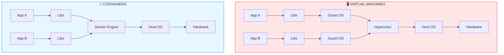

---
tags:
  - docker
  - containers
  - devops
  - essential
  - containerization
topic: Docker Container Fundamentals
---

# 🐳 Docker — Basics

> Docker packages applications with all their dependencies into portable containers. It's the foundation of modern DevOps and cloud-native applications.

---

## 🎯 Why Docker?

- 🚀 **Consistency** — "Works on my machine" is dead. Container runs the same everywhere.
- 📦 **Isolation** — Apps don't interfere with each other or the host
- ⚡ **Fast** — Containers start in seconds (vs minutes for VMs)
- 🌐 **Portable** — Same container runs on your laptop, AWS, Azure, anywhere
- 💾 **Lightweight** — Share the host kernel, use way less RAM than VMs
- 🔄 **Reproducible** — Dockerfile = infrastructure as code

**Real-world uses:**
- Package applications for deployment
- Isolated development environments
- Microservices architecture
- CI/CD pipelines
- Running one-off tools (databases, tests) without installing them
- Multi-tenant hosting

---

## 🆚 Containers vs Virtual Machines





| Layer 5 (Top) | Virtual Machines | Containers    |
| :------------ | :--------------- | :------------ |
| **Layer 5**   | App A / App B    | App A / App B |
| **Layer 4**   | Libs             | Libs          |
| **Layer 3**   | Guest OS         | *(shared)*    |
| **Layer 2**   | Hypervisor       | Docker Engine |
| **Layer 1**   | Host OS          | Host OS       |
| **Layer 0**   | Hardware         | Hardware      |


---

## 🏗️ Core Concepts

| Concept | What It Is |
|---------|-----------|
| **Image** | Read-only template (like a class in OOP) |
| **Container** | Running instance of an image (like an object) |
| **Dockerfile** | Recipe to build an image |
| **Registry** | Storage for images (Docker Hub, GHCR, ECR) |
| **Volume** | Persistent storage outside the container |
| **Network** | Communication between containers |
| **Compose** | Tool to manage multi-container apps |

---

## 📦 Installation

### Ubuntu/Debian
```bash
# Remove old versions
sudo apt remove docker docker-engine docker.io containerd runc

# Install prerequisites
sudo apt update
sudo apt install -y ca-certificates curl gnupg lsb-release

# Add Docker's official GPG key
sudo mkdir -p /etc/apt/keyrings
curl -fsSL https://download.docker.com/linux/ubuntu/gpg | \
  sudo gpg --dearmor -o /etc/apt/keyrings/docker.gpg

# Add repository
echo "deb [arch=$(dpkg --print-architecture) signed-by=/etc/apt/keyrings/docker.gpg] \
  https://download.docker.com/linux/ubuntu $(lsb_release -cs) stable" | \
  sudo tee /etc/apt/sources.list.d/docker.list > /dev/null

# Install Docker
sudo apt update
sudo apt install -y docker-ce docker-ce-cli containerd.io docker-compose-plugin

# Verify
sudo docker --version
sudo docker run hello-world
````

### Run Docker Without sudo (Recommended)

Bash

```
sudo usermod -aG docker $USER
newgrp docker

# Test (no sudo!)
docker run hello-world
```

⚠️ **Security note:** Adding a user to the `docker` group is essentially giving them root access. Only do this on personal machines.

---

## ⚡ Essential Docker Commands

### The "Big 5" You'll Use Daily

Bash

```
docker run              # Create & start container from image
docker ps               # List running containers
docker images           # List images
docker exec             # Run command in running container
docker logs             # View container output
```

---

## 🖼️ Working with Images

Bash

```
# Search for images
docker search nginx

# Pull an image
docker pull nginx
docker pull nginx:1.25          # Specific version (tag)
docker pull nginx:alpine        # Smaller variant

# List images
docker images
docker image ls

# Show image details
docker inspect nginx

# Remove image
docker rmi nginx
docker image rm nginx:1.25

# Remove all unused images
docker image prune
docker image prune -a           # Also remove tagged ones not in use

# Show disk usage
docker system df
```

### Understanding Image Tags

Bash

```
nginx                # Same as nginx:latest
nginx:1.25           # Specific version
nginx:alpine         # Alpine Linux variant (smaller)
nginx:1.25-alpine    # Combining both

# Registry paths
docker.io/library/nginx           # Default (Docker Hub)
ghcr.io/user/image:tag            # GitHub Container Registry
myregistry.com:5000/image:tag     # Private registry
```

---

## 🚀 Running Containers

### Basic Run

Bash

```
# Run a container (foreground)
docker run nginx

# Run in background (detached)
docker run -d nginx

# Give it a name
docker run -d --name my-web nginx

# Auto-remove when stopped
docker run --rm nginx

# Interactive shell
docker run -it ubuntu bash

# Run and remove, one-off command
docker run --rm alpine echo "Hello!"
```

### Port Mapping

Bash

```
# Map host port 8080 → container port 80
docker run -d -p 8080:80 --name web nginx

# Map to specific interface only
docker run -d -p 127.0.0.1:8080:80 nginx

# Random host port
docker run -d -P nginx
docker port <container>  # See what was assigned

# Multiple ports
docker run -d -p 80:80 -p 443:443 nginx
```

### Environment Variables

Bash

```
# Set env var
docker run -e DB_HOST=localhost -e DB_PORT=5432 myapp

# From file
docker run --env-file .env myapp
```

### Resource Limits

Bash

```
# Memory limit
docker run -m 512m nginx

# CPU limit (1.5 cores)
docker run --cpus=1.5 nginx

# Both
docker run -m 1g --cpus=2 nginx
```

---

## 📋 Managing Containers

Bash

```
# List running containers
docker ps

# List ALL containers (including stopped)
docker ps -a

# Just IDs
docker ps -q

# Stop a container
docker stop <container_name_or_id>

# Kill immediately (SIGKILL)
docker kill <container>

# Start a stopped container
docker start <container>

# Restart
docker restart <container>

# Pause/unpause
docker pause <container>
docker unpause <container>

# Remove a container (must be stopped first)
docker rm <container>

# Force remove (even if running)
docker rm -f <container>

# Remove all stopped containers
docker container prune

# Rename
docker rename old_name new_name
```

---

## 🔍 Inspecting Containers

Bash

```
# View logs
docker logs <container>
docker logs -f <container>              # Follow (like tail -f)
docker logs --tail 100 <container>      # Last 100 lines
docker logs --since 10m <container>     # Last 10 minutes

# Live stats (CPU, memory)
docker stats
docker stats <container>

# Processes running inside container
docker top <container>

# Full container info (JSON)
docker inspect <container>

# Just get IP address
docker inspect -f '{{.NetworkSettings.IPAddress}}' <container>

# See what changed in container
docker diff <container>
```

---

## 💻 Executing Commands in Containers

Bash

```
# Run shell inside running container
docker exec -it <container> bash
docker exec -it <container> sh          # If bash isn't available

# Run one-off command
docker exec <container> ls /etc

# As specific user
docker exec -u root -it <container> bash

# Copy files to/from container
docker cp file.txt <container>:/tmp/
docker cp <container>:/var/log/nginx.log ./
```

---

## 🗂️ Volumes (Persistent Storage)

⚠️ **By default, container data is lost when the container is removed!** Use volumes.

### Named Volumes (Recommended)

Bash

```
# Create volume
docker volume create mydata

# List volumes
docker volume ls

# Use in container
docker run -d -v mydata:/var/lib/mysql mysql

# Inspect
docker volume inspect mydata

# Remove
docker volume rm mydata

# Remove all unused volumes
docker volume prune
```

### Bind Mounts (Host Directory)

Bash

```
# Mount host directory
docker run -d -v /host/path:/container/path nginx

# Real example: serve local website
docker run -d -p 8080:80 -v $(pwd)/website:/usr/share/nginx/html nginx

# Read-only mount
docker run -d -v /host/config:/etc/config:ro myapp
```

### Modern Syntax (--mount)

Bash

```
docker run -d \
  --mount type=volume,source=mydata,target=/data \
  --mount type=bind,source=$(pwd)/config,target=/etc/app \
  myapp
```

### Volume Comparison

|Type|Use Case|
|---|---|
|**Named volume**|Databases, persistent app data (Docker manages location)|
|**Bind mount**|Development (edit files locally, see in container)|
|**tmpfs**|Sensitive data in memory only|

---

## 🌐 Networking

### Default Networks

Bash

```
docker network ls
# NETWORK ID     NAME       DRIVER    SCOPE
# abc123         bridge     bridge    local    ← default
# def456         host       host      local
# ghi789         none       null      local
```

### Create Custom Network

Bash

```
# Create a network
docker network create mynet

# Run containers on it
docker run -d --name db --network mynet postgres
docker run -d --name web --network mynet -p 8080:80 mywebapp

# Now web can reach db by hostname "db"!
docker exec web ping db
```

### Network Modes

Bash

```
# Bridge (default) - isolated network
docker run -d --network bridge nginx

# Host - use host's network directly (no isolation)
docker run -d --network host nginx

# None - no networking
docker run -d --network none alpine

# Connect running container to network
docker network connect mynet <container>

# Disconnect
docker network disconnect mynet <container>
```

---

## 📝 Dockerfile — Building Your Own Images

A Dockerfile is a recipe for building an image.

### Simple Example

Dockerfile

```
# Dockerfile
FROM ubuntu:22.04

# Metadata
LABEL maintainer="shashi@example.com"

# Install dependencies
RUN apt-get update && \
    apt-get install -y nginx && \
    rm -rf /var/lib/apt/lists/*

# Copy files
COPY index.html /var/www/html/

# Expose port
EXPOSE 80

# Start command
CMD ["nginx", "-g", "daemon off;"]
```

### Build and Run

Bash

```
# Build image
docker build -t mywebserver .

# Build with different Dockerfile
docker build -t myapp -f Dockerfile.prod .

# Build with build args
docker build --build-arg VERSION=1.2 -t myapp .

# Run it
docker run -d -p 8080:80 mywebserver
```

---

## 🧱 Dockerfile Instructions Explained

|Instruction|Purpose|Example|
|---|---|---|
|`FROM`|Base image|`FROM python:3.11`|
|`LABEL`|Metadata|`LABEL version="1.0"`|
|`RUN`|Execute command during build|`RUN apt install curl`|
|`COPY`|Copy from host to image|`COPY app.py /app/`|
|`ADD`|Like COPY + can extract tar/URL|`ADD file.tar.gz /tmp/`|
|`WORKDIR`|Set working directory|`WORKDIR /app`|
|`ENV`|Set environment variable|`ENV PORT=8080`|
|`ARG`|Build-time variable|`ARG VERSION=latest`|
|`EXPOSE`|Document port|`EXPOSE 80`|
|`VOLUME`|Declare volume|`VOLUME /data`|
|`USER`|Set user for RUN/CMD|`USER appuser`|
|`CMD`|Default command when container runs|`CMD ["python", "app.py"]`|
|`ENTRYPOINT`|Fixed executable|`ENTRYPOINT ["nginx"]`|
|`HEALTHCHECK`|Container health test|See below|

### CMD vs ENTRYPOINT

Dockerfile

```
# CMD - can be overridden
CMD ["python", "app.py"]
# docker run myimage → runs "python app.py"
# docker run myimage ls → runs "ls" (overrides!)

# ENTRYPOINT - always runs
ENTRYPOINT ["python"]
CMD ["app.py"]
# docker run myimage → runs "python app.py"
# docker run myimage other.py → runs "python other.py"
```

---

## 🎯 Real-World Dockerfile Examples

### Python Web App

Dockerfile

```
FROM python:3.11-slim

# Set working directory
WORKDIR /app

# Copy requirements first (better caching)
COPY requirements.txt .
RUN pip install --no-cache-dir -r requirements.txt

# Copy application
COPY . .

# Non-root user
RUN useradd -m appuser
USER appuser

# Expose port
EXPOSE 8000

# Health check
HEALTHCHECK --interval=30s --timeout=3s \
  CMD curl -f http://localhost:8000/health || exit 1

# Run
CMD ["python", "app.py"]
```

### Node.js App

Dockerfile

```
FROM node:20-alpine

WORKDIR /app

# Copy package files first (layer caching)
COPY package*.json ./
RUN npm ci --only=production

# Copy source
COPY . .

# Non-root user
USER node

EXPOSE 3000

CMD ["node", "server.js"]
```

### Multi-Stage Build (Smaller Images!)

Dockerfile

```
# Build stage
FROM golang:1.21 AS builder
WORKDIR /build
COPY . .
RUN go build -o myapp

# Runtime stage (much smaller)
FROM alpine:latest
RUN apk --no-cache add ca-certificates
WORKDIR /root/
COPY --from=builder /build/myapp .
EXPOSE 8080
CMD ["./myapp"]
```

**Result:** Instead of a 1GB Go image, you get a 15MB image! 🚀

---

## 🎨 Dockerfile Best Practices

### 1. Order Matters (Layer Caching)

Dockerfile

```
# ❌ BAD - changes to code invalidate all layers
COPY . .
RUN pip install -r requirements.txt

# ✅ GOOD - dependencies cached until requirements.txt changes
COPY requirements.txt .
RUN pip install -r requirements.txt
COPY . .
```

### 2. Combine RUN Commands

Dockerfile

```
# ❌ BAD - creates 3 layers
RUN apt-get update
RUN apt-get install -y nginx
RUN rm -rf /var/lib/apt/lists/*

# ✅ GOOD - one layer
RUN apt-get update && \
    apt-get install -y nginx && \
    rm -rf /var/lib/apt/lists/*
```

### 3. Use `.dockerignore`

text

```
# .dockerignore
node_modules
.git
.env
*.log
__pycache__
.venv
```

### 4. Use Specific Tags

Dockerfile

```
# ❌ BAD - "latest" changes over time
FROM python:latest

# ✅ GOOD - reproducible builds
FROM python:3.11.5-slim
```

### 5. Non-Root User

Dockerfile

```
# Always create and use a non-root user
RUN useradd -r -u 1001 appuser
USER appuser
```

### 6. Use Alpine or Slim When Possible

Dockerfile

```
FROM node:20-alpine      # ~180MB
# vs
FROM node:20             # ~1GB
```

---

## 🎼 Docker Compose (Multi-Container Apps)

Compose lets you define multi-container applications in a single YAML file.

### Example: `docker-compose.yml`

YAML

```
version: '3.8'

services:
  web:
    image: nginx:alpine
    ports:
      - "8080:80"
    volumes:
      - ./website:/usr/share/nginx/html
    depends_on:
      - api
    networks:
      - frontend

  api:
    build: ./api
    environment:
      - DB_HOST=db
      - DB_PORT=5432
    depends_on:
      - db
    networks:
      - frontend
      - backend

  db:
    image: postgres:15
    environment:
      POSTGRES_USER: admin
      POSTGRES_PASSWORD: secret
      POSTGRES_DB: myapp
    volumes:
      - db_data:/var/lib/postgresql/data
    networks:
      - backend

volumes:
  db_data:

networks:
  frontend:
  backend:
```

### Compose Commands

Bash

```
# Start all services (detached)
docker compose up -d

# Stop all
docker compose down

# Stop and remove volumes
docker compose down -v

# View logs
docker compose logs
docker compose logs -f web

# Restart a service
docker compose restart web

# Rebuild images
docker compose build
docker compose up -d --build

# Scale a service
docker compose up -d --scale web=3

# Execute command in service
docker compose exec web bash

# List services
docker compose ps
```

---

## 🔍 Debugging Containers

### Container Won't Start?

Bash

```
# Check logs
docker logs <container>

# Try running interactively
docker run -it --entrypoint bash <image>

# Check what image expects
docker inspect <image>
```

### Container Running but App Broken?

Bash

```
# Shell in
docker exec -it <container> bash

# Check processes
docker top <container>

# Check resource usage
docker stats <container>

# Check network
docker exec <container> curl localhost:8080
docker exec <container> netstat -tulpn
```

### "Port Already in Use"?

Bash

```
# Find what's using the port
sudo netstat -tulpn | grep 8080
sudo lsof -i :8080

# Or use different port
docker run -p 8081:80 nginx
```

---

## 🧹 Cleanup Commands

Docker uses lots of disk. Clean up regularly!

Bash

```
# Show disk usage
docker system df

# Remove stopped containers, unused networks, dangling images, build cache
docker system prune

# Also remove unused volumes (careful!)
docker system prune --volumes

# Remove ALL unused images (not just dangling)
docker system prune -a

# Nuclear option (removes EVERYTHING not currently used)
docker system prune -a --volumes -f
```

### Individual Cleanup

Bash

```
docker container prune        # Remove stopped containers
docker image prune            # Remove dangling images
docker image prune -a         # Remove all unused images
docker volume prune           # Remove unused volumes
docker network prune          # Remove unused networks
docker builder prune          # Remove build cache
```

---

## 📤 Docker Registry & Sharing

### Docker Hub

Bash

```
# Login
docker login

# Tag image for your account
docker tag myapp:latest username/myapp:v1.0

# Push
docker push username/myapp:v1.0

# Pull from anywhere
docker pull username/myapp:v1.0
```

### Private Registry

Bash

```
# Run your own registry
docker run -d -p 5000:5000 --name registry registry:2

# Tag for private registry
docker tag myapp:latest localhost:5000/myapp:v1

# Push
docker push localhost:5000/myapp:v1
```

---

## ⚠️ Common Pitfalls

- ❌ Running containers as root (security risk)
- ❌ Using `latest` tag in production (unreproducible)
- ❌ Storing data inside container (lost on removal!)
- ❌ Ignoring `.dockerignore` (huge build context, slow builds)
- ❌ Not cleaning up (Docker eats disk space)
- ❌ Putting secrets in Dockerfile (use env vars or secrets)
- ❌ One giant container running multiple services (use compose)
- ❌ Not using multi-stage builds (bloated images)
- ❌ Missing HEALTHCHECK (Docker doesn't know if app is broken)
- ❌ Ignoring exit codes and logs

---

## 🔐 Security Best Practices

1. **Never run as root** in containers
2. **Scan images for vulnerabilities:**
    
    Bash
    
    ```
    docker scan myimage
    # Or use trivy
    trivy image myimage
    ```
    
3. **Use official images** from trusted sources
4. **Keep images updated** — patch regularly
5. **Don't expose Docker socket** unless absolutely necessary
6. **Use secrets** for sensitive data (not env vars)
7. **Read-only filesystems** where possible:
    
    Bash
    
    ```
    docker run --read-only myapp
    ```
    
8. **Drop capabilities:**
    
    Bash
    
    ```
    docker run --cap-drop=ALL --cap-add=NET_BIND_SERVICE nginx
    ```
    
9. **Limit resources** (CPU, memory)
10. **Sign images** with Docker Content Trust

---

## 🎯 Real-World Scenarios

### Scenario 1: Test Software Without Installing

Bash

```
# Try MySQL without installing
docker run --rm -it mysql:8 mysql --version

# Test different Python versions
docker run --rm -it python:3.11 python
docker run --rm -it python:3.12 python
```

### Scenario 2: Run a One-Off Database

Bash

```
docker run -d --name devdb \
  -e POSTGRES_PASSWORD=devpass \
  -p 5432:5432 \
  -v pgdata:/var/lib/postgresql/data \
  postgres:15
```

### Scenario 3: Local Dev Environment

YAML

```
# docker-compose.yml for a Python dev environment
version: '3.8'
services:
  app:
    build: .
    volumes:
      - .:/app                  # Live code reload
    ports:
      - "8000:8000"
    environment:
      - DEBUG=true
    depends_on:
      - redis
      - db
  
  redis:
    image: redis:alpine
    ports:
      - "6379:6379"
  
  db:
    image: postgres:15
    environment:
      POSTGRES_PASSWORD: dev
    ports:
      - "5432:5432"
```

Bash

```
docker compose up
# Edit code locally, changes reflected immediately!
```

### Scenario 4: CI/CD Pipeline

Bash

```
# Build tag with commit hash
docker build -t myapp:$(git rev-parse --short HEAD) .

# Push to registry
docker push myapp:$(git rev-parse --short HEAD)

# Deploy on server
ssh prod "docker pull myapp:abc123 && docker compose up -d"
```

---

## 🛠️ Useful Command Combos

Bash

```
# Stop all running containers
docker stop $(docker ps -q)

# Remove all containers
docker rm -f $(docker ps -aq)

# Remove all images
docker rmi -f $(docker images -q)

# View resource usage of all containers
docker stats --no-stream

# Follow logs of all compose services
docker compose logs -f

# Enter last created container
docker exec -it $(docker ps -lq) bash

# Copy from container to host
docker cp $(docker ps -lq):/etc/nginx/nginx.conf ./
```

---

## 🔗 Related Notes

- [[_Automation-Index|🤖 Automation Index]]
- [[Bash-Basics|🐚 Bash Basics]]
- [[Python-for-Sysadmins|🐍 Python for Sysadmins]]
- [[Ansible-Basics|🤖 Ansible Basics]]
- [[_Networking-Index|🌐 Networking Index]]
- [[Systemd Commands|⚙️ Systemd]]

---

## 📚 External References

- 🌐 [Official Docker Docs](https://docs.docker.com/)
- 🌐 [Docker Hub](https://hub.docker.com/) — image registry
- 🌐 [Play with Docker](https://labs.play-with-docker.com/) — free online playground
- 🌐 [Awesome Docker](https://github.com/veggiemonk/awesome-docker) — curated resources
- 📖 Book: _"Docker Deep Dive" by Nigel Poulton_
- 📺 YouTube: _"Docker Tutorial for Beginners" by TechWorld with Nana_

---

## 🎯 Interview Questions — Docker

<details> <summary>Click to expand</summary>

### Basic

1. What is Docker and how does it differ from a VM?
2. What's the difference between an image and a container?
3. What is a Dockerfile?
4. Difference between `docker run` and `docker start`?
5. How do you persist data in Docker?

### Intermediate

6. What's the difference between `CMD` and `ENTRYPOINT`?
7. What's the difference between `COPY` and `ADD`?
8. How do containers communicate with each other?
9. What is a multi-stage build and why use it?
10. How do you reduce Docker image size?
11. What is Docker Compose and when do you use it?
12. Explain volumes vs bind mounts.

### Advanced

13. What are Docker networks? Explain bridge, host, and overlay.
14. How does Docker use Linux namespaces and cgroups?
15. What are the security concerns with Docker?
16. How do you handle secrets in Docker?
17. Explain how Docker layer caching works.
18. What is the Docker daemon and containerd?
19. How would you troubleshoot a container that keeps restarting?
20. What's the difference between Docker Swarm and Kubernetes?

</details>

---

## 🧪 Practice Exercises

- [ ]  Run an nginx container and access it from your browser
- [ ]  Build a simple Dockerfile for a "Hello World" web app
- [ ]  Run a PostgreSQL container with persistent volume
- [ ]  Create a docker-compose.yml with a web app + database
- [ ]  Build a multi-stage Dockerfile for a Node.js app
- [ ]  Set up a local Docker registry
- [ ]  Create a container that runs a cron job
- [ ]  Debug a container that's failing to start
- [ ]  Push an image to Docker Hub
- [ ]  Set up a health check for a container

---

## 💡 Pro Tips

1. **Use `docker compose` (v2) not `docker-compose` (v1)** — v1 is deprecated
2. **Always `.dockerignore`** — massively speeds up builds
3. **Alpine images = smaller, faster** but sometimes miss packages
4. **Named volumes > bind mounts** for production
5. **Use `docker system prune` weekly** — save gigabytes
6. **Tag images meaningfully:** `myapp:1.2.3` not `myapp:latest`
7. **HEALTHCHECK is underrated** — Docker restarts unhealthy containers
8. **Learn `docker inspect`** — reveals everything about a container
9. **Multi-stage builds are essential** — 10x smaller images
10. **Don't fight Docker** — do things the "Docker way," not the VM way

---

## 🚀 Quick Reference Card

Bash

```
# Images
docker pull IMAGE                    # Download
docker images                        # List
docker rmi IMAGE                     # Remove
docker build -t NAME .               # Build

# Containers
docker run -d --name NAME IMAGE      # Start detached
docker ps                            # List running
docker ps -a                         # List all
docker stop NAME                     # Stop
docker rm NAME                       # Remove
docker exec -it NAME bash            # Shell in
docker logs -f NAME                  # Follow logs

# Volumes
docker volume create NAME            # Create
docker volume ls                     # List
docker run -v NAME:/path IMAGE       # Use

# Networks  
docker network create NAME           # Create
docker network ls                    # List
docker run --network NAME IMAGE      # Use

# Compose
docker compose up -d                 # Start all
docker compose down                  # Stop all
docker compose logs -f               # Logs
docker compose ps                    # Status

# Cleanup
docker system prune                  # Basic cleanup
docker system prune -a --volumes     # Deep clean
```